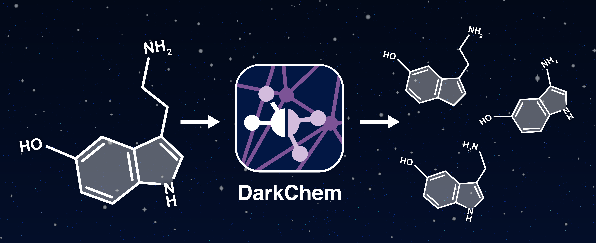

DarkChem
========

Overview
--------
DarkChem employs a variational autoencoder (VAE) to learn a continuous numerical, or latent, representation of molecular structure, to simultaneously characterize and expand reference libraries for small molecule identification.  DarkChem includes a chemical property decoder, trained as a multitask network, in order to shape the latent representation such that it assembles according to desired chemical properties.  The approach is unique in its application to metabolomics and small molecule identification and in its focus on properties that can be obtained from experimental instruments (mass, CCS). Once trained, the network can be used to predict chemical properties directly from structure, as well as generate candidate structures with chemical properties similar to some arbitrary input. 

<p align="center">
  
</p>

Installation
------------
Use [``conda``](https://www.anaconda.com/download/) to create a new virtual environment with required dependencies:
```bash
conda create -n darkchem -c conda-forge -c rdkit -c openbabel keras tensorflow rdkit openbabel numpy scipy scikit-learn matplotlib seaborn pandas python=3
```

Activate the virtual environment:
```
conda activate darkchem
```

Install DarkChem using [``pip``](https://pypi.org/project/pip/):
```bash
# clone/install
git clone https://github.com/pnnl/darkchem.git
pip install darkchem/

# direct
pip install git+https://github.com/pnnl/darkchem
```

Getting Started
---------------
The easiest way to get started with DarkChem is to use the supplied CLI entry points. Data can be preprocessed with ``darkchem-prep``, resulting files can be used to train with ``darkchem-train``, and evaluation/prediction with new data can be performed with ``darkchem-evaluate``. The ``--help`` or ``-h`` flag can be used with each of these commands for additional information.

More advanced functionality requires the use of DarkChem as an API. For example, in order to load pre-trained weights and predict the latent represenation of a set of structures:
```
import numpy as np
import darkchem            
 
# load model
model = darkchem.utils.load_model(‘/path/to/model_folder/’) # arguments.txt must be present in this folder, as well as respective network weights
 
# load data
x = np.load(‘/path/to/smiles.npy’)
 
# generate latent space
x_latent = model.encoder.predict(x)
 
# generate property predictions
y_pred = model.predictor.predict(x_latent)
 
# predict SMILES outputs
x_pred = model.decoder.predict(x_latent)
```

Disclaimer
----------
This material was prepared as an account of work sponsored by an agency of the United States Government. Neither the United States Government nor the United States Department of Energy, nor Battelle, nor any of their employees, nor any jurisdiction or organization that has cooperated in the development of these materials, makes any warranty, express or implied, or assumes any legal liability or responsibility for the accuracy, completeness, or usefulness or any information, apparatus, product, software, or process disclosed, or represents that its use would not infringe privately owned rights.

Reference herein to any specific commercial product, process, or service by trade name, trademark, manufacturer, or otherwise does not necessarily constitute or imply its endorsement, recommendation, or favoring by the United States Government or any agency thereof, or Battelle Memorial Institute. The views and opinions of authors expressed herein do not necessarily state or reflect those of the United States Government or any agency thereof.

PACIFIC NORTHWEST NATIONAL LABORATORY operated by BATTELLE for the UNITED STATES DEPARTMENT OF ENERGY under Contract DE-AC05-76RL01830
